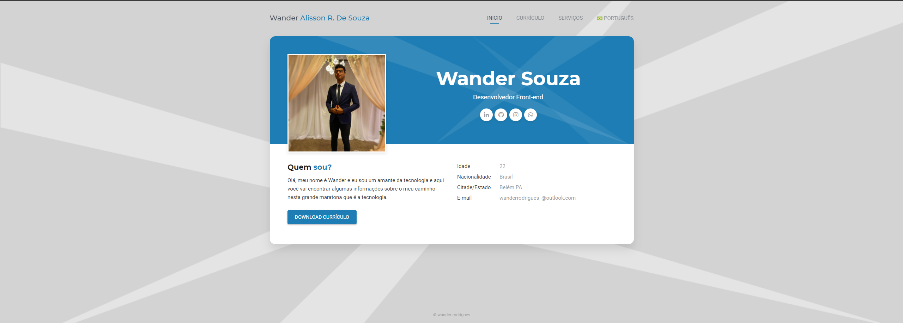
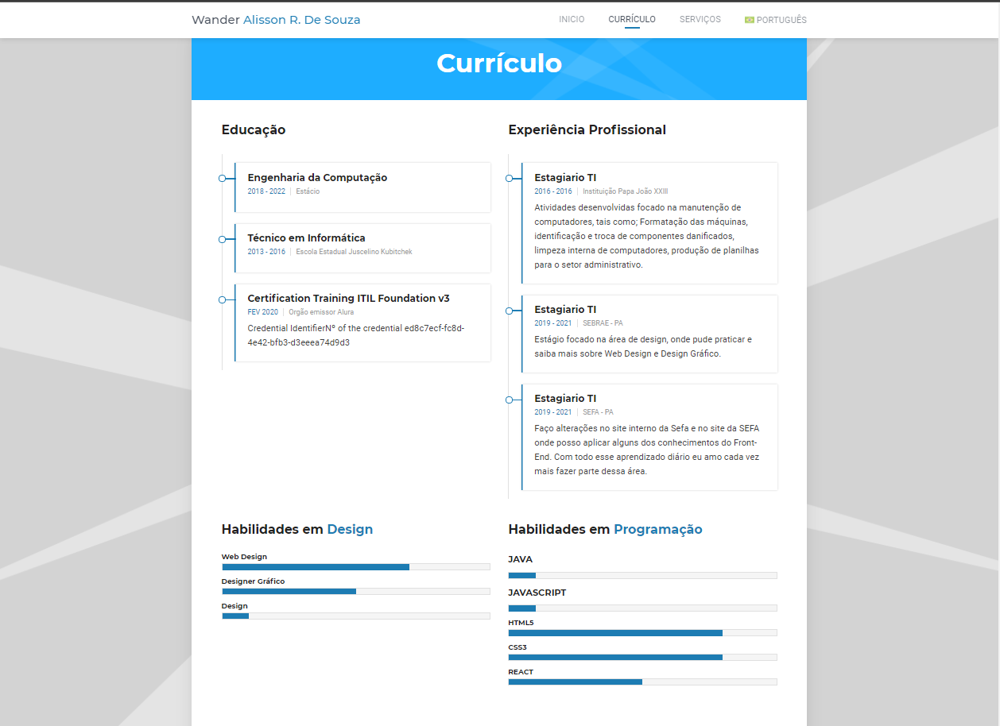
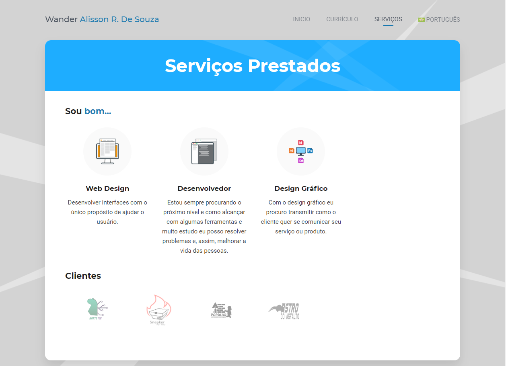

<h4 align="center"> 
	🚧 🚀 Em construção...  🚧
</h4>

## Features

- [x] Estrutura do Projeto
- [x] Criação de Grid
- [x] Criação de styles.css
- [ ] Testimonials
- [ ] Page portfolio


# Cúrriculo online 


Este projeto nada mais é que uma página html estática, que foi utilizada p/ testar conceitos práticos do uso das ferramentas **HTML, CSS AND JAVASCRIPT**

<p align="center">
  
</p>

<p align="center">
  
</p>
<p align="center">
  
</p>

## Instalação 

Basta clonar o repositório da forma desejada.

```
$ git clone git@github.com:Wander27Rodrigues/site_wander.git
```

## Histórico de atualização 

* 0.0.1;
    * Lançamento inicial.

Wander Rodrigues De Souza - <wanderordrigues_@outlook.com>


